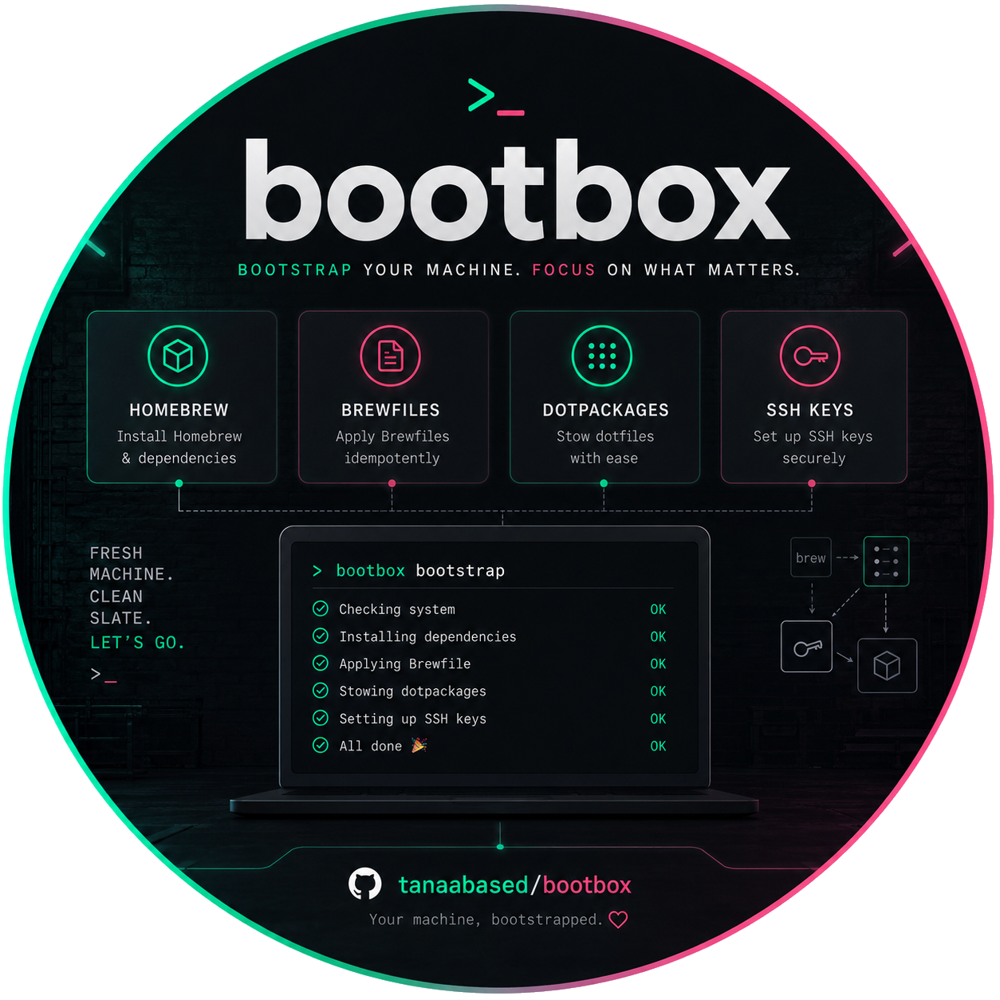

# `bootbox`

<p align="center">
  
</p>

<p align="center">
  <a href="https://github.com/tanaabased/bootbox/releases"></a>
  <a href="https://app.netlify.com/projects/tanaab-bootbox-sh/deploys"></a>
  
  
</p>

`bootbox` is a hosted bootstrap script for taking a fresh macOS or Linux machine to a usable
current-user foundation. It installs or uses Homebrew, applies Brewfiles, stows dotpackages into
`$HOME`, and can install private SSH keys from 1Password.

> Supports macOS 26 or newer and 64-bit Linux on `x64` and `arm64`. CI covers Ubuntu 24.04.

## Overview

At a high level, `bootbox`:

- installs Homebrew into the platform's canonical prefix when it is missing
- installs the core Git, cURL, Zsh, jq, GNU Stow, and beta 1Password CLI toolchain
- applies one or more local or remote Brewfiles
- stows one or more dotpackages into the invoking user's `$HOME`
- optionally installs private SSH keys from a 1Password vault

Homebrew commands and current-user configuration run without sudo. Only missing Homebrew
installation may require elevation, and an existing Homebrew installation must already be
manageable by the invoking user.

For platform requirements, installed-component details, and the complete configuration contract,
see [ADVANCED.md](./ADVANCED.md).

## Quickstart

Run the hosted bootstrap:

```sh
/bin/bash -c "$(curl -fsSL https://bootbox.tanaab.sh/bootbox.sh)" bootbox
```

Pass options directly after the `bootbox` command placeholder when selecting additional inputs:

```sh
/bin/bash -c "$(curl -fsSL https://bootbox.tanaab.sh/bootbox.sh)" bootbox \
  --brewfile Brewfile.work \
  --dotpkg dotpkgs/git
```

Run the hosted help directly for the complete option and environment-variable contract:

```sh
/bin/bash -c "$(curl -fsSL https://bootbox.tanaab.sh/bootbox.sh)" bootbox --help
```

## Usage

For repeated use, install the hosted script as a local command in a directory you manage on
`PATH`:

```sh
mkdir -p "$HOME/.local/bin"
curl -fsSL https://bootbox.tanaab.sh/bootbox.sh -o "$HOME/.local/bin/bootbox"
chmod +x "$HOME/.local/bin/bootbox"

bootbox --help
```

Run it with flags when you want to keep the selected behavior explicit:

```sh
bootbox --brewfile Brewfile.work --dotpkg dotpkgs/git

bootbox \
  --ssh-key "my-vault/id_work:id_ed25519_work" \
  --op-token "$BOOTBOX_OP_TOKEN"
```

Successful runs that apply changes finish with `bootbox setup succeeded`. Use `--quiet` when a
wrapper should suppress normal status output, including that final success message.

Common inputs:

| Option       | Environment variable | Description                                                       |
| ------------ | -------------------- | ----------------------------------------------------------------- |
| `--brewfile` | `BOOTBOX_BREWFILE`   | Repeatable local path or URL for Homebrew Bundle input.           |
| `--dotpkg`   | `BOOTBOX_DOTPKG`     | Repeatable GNU Stow package applied to the current user's home.   |
| `--ssh-key`  | `BOOTBOX_SSH_KEY`    | Repeatable `vault/item[:filename]` private SSH-key specification. |
| `--op-token` | `BOOTBOX_OP_TOKEN`   | 1Password service account token used for private SSH-key access.  |
| `--yes`      | `NONINTERACTIVE`     | Accept the plan and run without interactive prompts.              |
| `--force`    | `BOOTBOX_FORCE`      | Allow supported existing SSH-key destinations to be overwritten.  |
| `--debug`    | `BOOTBOX_DEBUG`      | Show detailed diagnostics with the 1Password token masked.        |

CLI options override environment inputs. The first occurrence of a repeatable CLI option replaces
its environment-sourced list, and later occurrences append.

Use [ADVANCED.md#configuration-reference](./ADVANCED.md#configuration-reference) for every public
option, environment variable, default, and input rule.

## Development

This repository uses Bun for repo-local tooling and publishes a Netlify-ready `dist/` directory:

```sh
git clone https://github.com/tanaabased/bootbox.git
cd bootbox
bun install
bun run lint
```

`bun run build` and Leia scenarios are CI-owned by default because they generate `dist/` or
mutate macOS and Ubuntu runner state.

## Issues, Questions and Support

Use the [GitHub issue queue](https://github.com/tanaabased/bootbox/issues) for bugs, regressions,
or feature requests.

## Changelog

See [`CHANGELOG.md`](./CHANGELOG.md) for release history and
[GitHub releases](https://github.com/tanaabased/bootbox/releases) for published artifacts.

## Maintainers

- [@pirog](https://github.com/pirog)

## Contributors

<a href="https://github.com/tanaabased/bootbox/graphs/contributors">
  
</a>

Made with [contrib.rocks](https://contrib.rocks).
